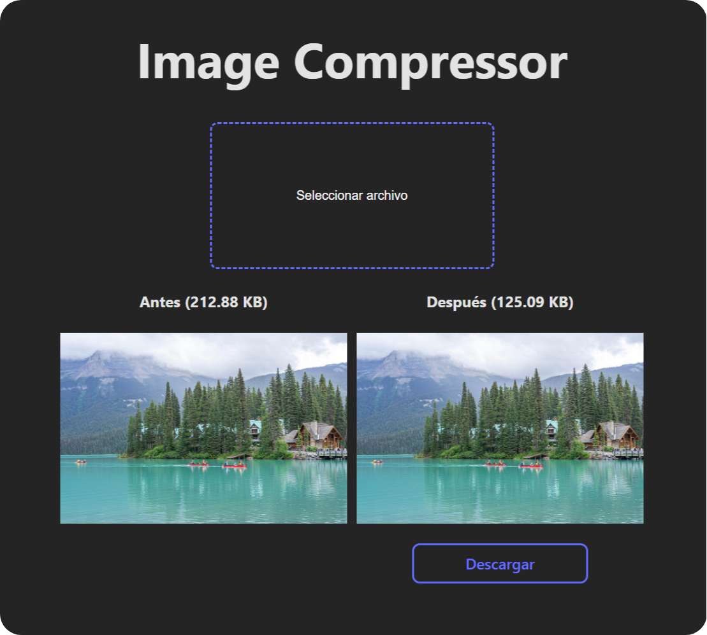

# 🖼️ Image Compressor ReactJs


## 🚀 DEMO
### [Deploy](https://image-compressor-react-js.vercel.app/)

## 💻 Tutorial
<a href='https://youtu.be/yiD1W3-XV6k' target='_blank'>
    
</a>

## 📋 Features
- Compress image
- Download compressed image

## 📦 Getting Started
```
git clone https://github.com/garu2/Image-Compressor-ReactJs.git
```
```
cd Image-Compressor-ReactJs
```
```
npm install
```
```
npm run dev
```
The app will be available at `http://localhost:5173`

## ⚙️ Technologies
* [Vite.js](https://vitejs.dev/)
* [React](https://reactjs.org/)
* [Vercel](https://vercel.com/)

